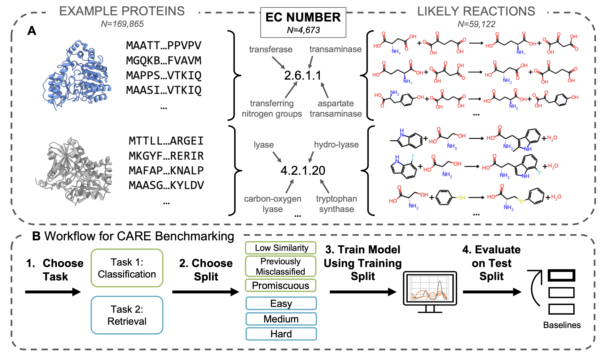
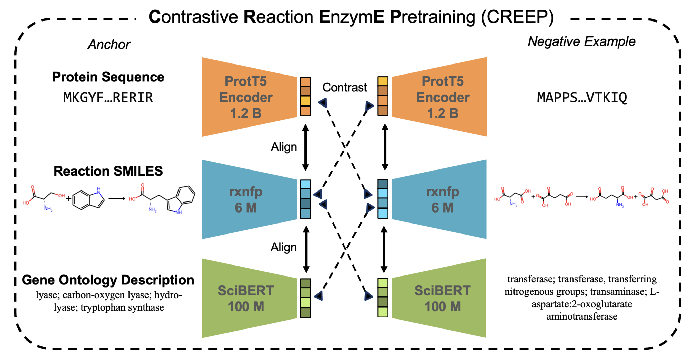

# CARE:  a Benchmark Suite for the Classification and Retrieval of Enzymes

CARE is a datasets and benchmarks suite to evaluate the performance of models to predict the functions of enzymes. CARE is split into two tasks: classification of enzyme sequences based on Enzyme Commission (EC) number (Task 1), and retrieval of EC number given a reaction (Task 2).

## Datasets and splits
Processed datasets/splits should should be downloaded from [datasets.zip](https://zenodo.org/records/12195378). to replace the empty folders `processed_data` and `splits`, respectively. Note that in the full datasets and train sets, every row represents a unique protein-EC pair, or a unique reaction-EC pair. In the test sets, every row is also a unique protein-EC or reaction-EC pair, except for the promiscuous test set, where each row maps a protein seqeunce to a list of corresponding ECs.

The table below summarizes which files should be used for each train-test split described in the work.

| Task | Split |Train File | Test File | Optional Train Files |
|:--------|:-------:|:-------:|:-------:|:-------:|
| Task 1 | <30% Identity | `protein_train.csv` | `30_protein_test.csv` | `reaction2EC.csv` `text2EC.csv`|
|  | 30-50% Identity | `protein_train.csv` | `30-50_protein_test.csv` | `reaction2EC.csv` `text2EC.csv`|
|  | 50-70% Identity | `protein_train.csv` | `50-70_protein_test.csv` | `reaction2EC.csv` `text2EC.csv`|
|  | 70-90% Identity | `protein_train.csv` | `70-90_protein_test.csv` | `reaction2EC.csv` `text2EC.csv`|
|  | Misclassified (Price) | `protein_train.csv` | `price_protein_test.csv` | `reaction2EC.csv` `text2EC.csv`|
|  | Promiscuous | `protein_train.csv` | `promiscuous_protein_test.csv` | `reaction2EC.csv` `text2EC.csv`|

| Task | Split |Train File | Test File |  Optional Train Files |
|:--------|:-------:|:-------:|:-------:|:-------:| 
| Task 2 |  Easy | `easy_reaction_train.csv` | `easy_reaction_test.csv` | `protein2EC.csv` `text2EC.csv`|
|  | Medium | `medium_reaction_train.csv` | `medium_reaction_test.csv` |  `protein2EC.csv` `text2EC.csv`|
|  | Hard | `hard_reaction_train.csv` | `hard_reaction_test.csv` |  `protein2EC.csv` `text2EC.csv`|

## Performance Evaluation
The goal for each baseline method is to ouput a ranking of EC numbers from best to worst. Afterward, performance metrics for benchmarking can be obtained using `performance_evaluation.ipynb`. Required format for analysis of each model on each split is a .csv file where each row is an entry in the test set, and each entry is associated with a ranking of EC numbers ranked from best to worst. Examples of this format (the final reulsts of all the baselines included in our study) are provided in `task1_baselines/results_summary` and `task2_baselines/results_summary`.

Performance analysis can be performed in most environments with minimal packages. The standard performance metric is k=1 classification/retrieval accuracy, but we also provide code to calculate other metrics in this notebook. The output for k=1 accuracy should look something like this:
| Method | Level 4 Accuracy (X.X.X.X) | Level 3 Accuracy (X.X.X.-) | Level 2 Accuracy (X.X.-.-) | Level 1 Accuracy (X.-.-.-) |
|:--------|:-------:|:-------:|:-------:|:-------:|
| Name |  54.1 | 60.4 | 81.0 | 95.5 |
| ... | ... | ...|  ...|  ... |

## CARE Package: for reproducing dataset processing/splitting and reproducing benchmarking results

### Installation
If you are interested in the reproducing the dataset curation/splitting, training and inference, and analyses in our study, then proceed to clone this repo and install the CARE package below. The CARE package is capable of performing, in a single command, many of steps that are alternatively provided as scripts or jupyter notebooks. Note that the CARE package is still under construction, so please come back for working versions.

```
git clone https://github.com/jsunn-y/CARE/
cd CARE
conda create -n CARE_processing python=3.8 -y

conda activate CARE_processing
conda install -c rdkit rdkit=2020.03.3 -y
conda install -c conda-forge -c bioconda mmseqs2 -y
pip install dist/care.0.0.1.tar.gz
```

### Reproducing dataset/split processing

Detailed instructions on using the CARE package will be added soon! Alteratively, the steps used to generate the datasets and splits for this work can be reproduced using the jupyter notebooks in `generate_dataset_splits` with an overview [here](generate_datasets_splits). The raw data used here can be downloaded from [CARE_pretrained.zip](https://zenodo.org/records/12195378) to replace  `generate_datasets_splits/raw_data`.

### Reproducing benchmarking on Task 1 

Detailed instructions for reproducing our baselines on Task 1 and general recommendations for benchmarking on Task 1 can be found [here](task1_baselines).

### Reproducing benchmarking on Task 2 

Detailed instructions for reproducing our baselines on Task 2 and general recommendations for benchmarking on Task 2 can be found .

## CREEP

We also introduce Contrastive Reaction-EnzymE Pretraining (CREEP), which is one of the first models that can perform Task 2 by aligning representations from different modalities (reaction, protein, and optionally textual description). The model is found under `CREEP`, while example usage is found under `task2_baselines/CREEP` with instructions [here](task2_baselines). CREEP involved finetuning pretrained language models, some of which can be downloaded from hugging face and are also compiled within [CARE_pretrained.zip](https://zenodo.org/records/12195378).

#### CREEP installation
For CREEP model training and inference
** Note **: only install this environment if you would like to run training and inference with CREEP.

```
cd CREEP
conda create -n CREEP python=3.8
conda activate CREEP
#we recommend installing this way so that torch is compatible with your GPU and your version of CUDA
pip install pandas torch==2.2.0 transformers==4.39.1 sentencepiece
pip install -e .
```
